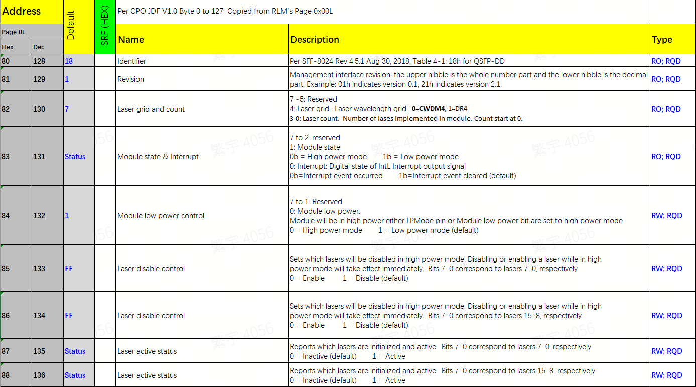
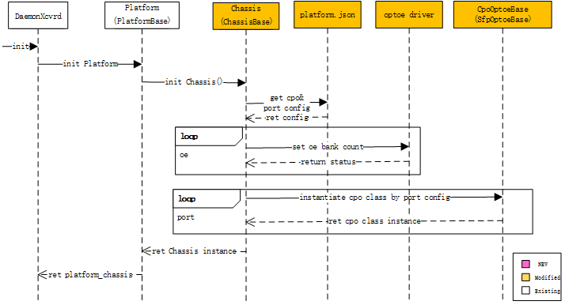
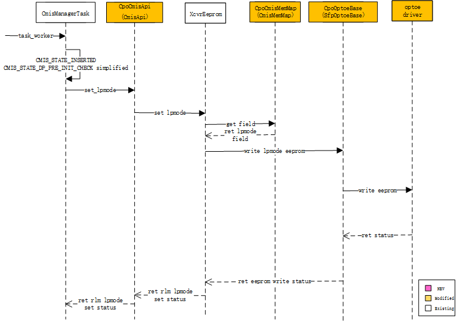

# CPO Community adaption

## Table of Content

## 1. Revision

| Rev |   Date   | Author | Change Description |
| :-: | :------: | :----: | ------------------ |
| 1.0 | Dec 2025 | kroos | Initial version    |

## 2. Scope

This section describes the implementation of cpo in community frame.

Firmware upgrade is not within the scope of this design description.

## 3. Definitions/Abbreviations

OE: Optical Engine

PLS : Pluggable Laser Sources

CPO: Co-packaged optics

CMIS ： Common Management Interface Specification

## 4. Overview

As shown in the figure below, current CPO devices map OE and PLS components to standard CMIS controllers.

The community xcvrd optical module framework is basically applicable to CPO devices. However, CPO devices still have some special functions that require revisions to the original community code. This document redesigns and revises some functions of the sonic-platform based on the differences between CPO and traditional optical modules.


## 5. Requirements

The management of CPO switches based on the community xcvrd framework mainly involves the following aspects:

1. CPO devices are managed by mapping OE/PLS to the CMIS memory map.The OE part is a CMIS general register, and no special handling is required in the community code. However, the PLS-related registers are currently mapped to the CMIS memory map page: 0xb0-0xb7 addresses. Therefore, it is necessary to add PLS-related management interfaces.
2. CPO devices use multiple banks in the CMIS memory map. However, there is currently no multi-bank processing logic in the community code.
   Therefore, it is necessary to add a multi-bank management process.
3. There is a many-to-one mapping relationship between CPO device ports and OE or PLS. Manufacturers need to maintain the mapping entries between ports and OE/PLS when adapting devices.
4. Community xcvrd management is triggered based on module plug-in events. CPO has no plug-in events, so the xcvrd triggering method needs to be redesigned.

## 6. High-Level Design

### 6.1. Problem Statement

1. PLS-related registers are located in the CMIS Custom section and have not yet formed a universal standard, so they are not reflected in the community code.
2. The current community code has no CMIS multi-bank processing logic.
3. Traditional ports have a one-to-one correspondence with optical modules, which cannot meet the processing logic of CPO devices (where multiple ports correspond to one OE/PLS).
4. There are no insertion/removal events of CPO port modules.

### 6.2. New Approach

#### 6.2.1. Sff8024

To address the above issues, the community code needs to handle CPO devices differently. Therefore, a CPO device identification interface is first required.

CPO currently has no new standard definition in the sff8024 specification. We hope that in the future we can apply for a dedicated identifier for CPO products through the SFF standards organization.

At present, the identifier of OE defined in cmis Memory Map page 0; offset 0 is 0x80 (Vendor Specific).

Modify the sff8024 definition:

```
#sff8024.py
class Sff8024(XcvrCodes):
    XCVR_IDENTIFIERS = {
        128: 'CPO' }
```

#### 6.2.2. CmisMemMap

Due to the need to add management support for PLS and to handle multi‑bank management in CMIS, the original community `CmisMemMap` class needs to be revised.

Currently, one OE corresponds to two PLS units in a CPO device, but the functions mapped to each PLS’s memory‑map offset addresses are identical. This design provides external functional access interfaces for PLS, and multiple PLS instances achieve distinct access through page offset addresses defined in the configuration file.
The figure below shows an example of the PLS page: 0xB0 memory‑map:



The examples are as follows:

1. Added some PLS-related memory map access functions.
2. Revised getaddr to support multi-bank addressing

```
PAGES_PER_BANK  = 240
class CpoCmisMemMap(CmisMemMap):   # new
    def __init__(self, codes, bank):
        super(CmisMemMap, self).__init__(codes)
        self._bank = bank
        self.PLS_CONTROL_STATUS = RegGroupField(consts.PLS_CONTROL_STATUS_FIELD,
            CodeRegField(consts.Identifier, self.getaddr(0x0, 0x80), self.codes.XCVR_IDENTIFIERS),
            CodeRegField(consts.Revision, self.getaddr(0x0, 0x81), size=1),
            CodeRegField(consts.Laser_grid_and_count, self.getaddr(0x0, 0x82), size=1), **kwargs)
        self.PLS_ADMIN_INFO = RegGroupField(consts.PLS_ADMIN_INFO_FIELD, *fields,
            CodeRegField(consts.VENDOR_NAME, self.getaddr(0x1, 0x81), size=16, **kwargs)
        self.PLS_THRESHOLDS = RegGroupField(consts.PLS_THRESHOLDS_FIELD, *fields, **kwargs)
        self.PLS_LP_MODE = NumberRegField(consts.PLS_LP_MODE, self.getaddr(0x2, 0x80), size=1),
        ...
    def getaddr(self, page, offset, page_size=128):
        if 0 <= page <= 0x1f:
            bank_id = 0
        else:
            bank_id = self._bank
        return ((bank_id * PAGES_PER_BANK + page) * page_size + offset;
```

The kernel address mapping is as follows (detailed in subsequent chapters):

```
                    +-------------------------------+
                    |        Lower Page             |
                    +-------------------------------+
                    |  Upper Page (Bank 0, Page 0h) |
                    +-------------------------------+
                    |  Upper Page (Bank 0, Page 1h) |
                    +-------------------------------+
                    |             ...               |
                    +-------------------------------+
                    | Upper Page (Bank 0, Page FFh) |
                    +-------------------------------+
                    | Upper Page (Bank 1, Page 10h) |
                    +-------------------------------+
                    |             ...               |
                    +-------------------------------+
                    | Upper Page (Bank 1, Page FFh) |
                    +-------------------------------+
                    | Upper Page (Bank 2, Page 10h) |
                    +-------------------------------+
                    |             ...               |
                    +-------------------------------+
                    | Upper Page (Bank 2, Page FFh) |
                    +-------------------------------+
                    |             ...               |
                         (continued for more banks)
```

#### 6.2.3. CmisApi

Similarly, the corresponding `CmisApi` class also needs to be revised. The examples are as follows:

API revision:

```
class CpoCmisApi(CmisApi):   # new
    def get_pls_lpmode(self):
       pls_lpmode = self.xcvr_eeprom.read(consts.PLS_LP_MODE, is_pls=True)
    def set_pls_lpmode(self, lpmode, wait_state_change = True):
    def get_pls_manufacturer(self):
    def get_pls_vendor_rev(self):
    def get_pls_identifier(self):
    def get_pls_laser_disable(self):
    def set_pls_laser_disable(self,  disable，wait_state_change = True):
    ...

```

#### 6.2.4 XcvrApiFactory

Modify the class instance for CPO processing.

The main revisions are as follows:

1. Use CPO-related classes for CPO-type devices.
2. Instantiation of `CpoCmisMemMap` requires passing bank_id as an argument.

```
#xcvr_api_factory.py
class XcvrApiFactory(object):
    def __init__(self, reader, writer, bank=0):
        self._bank= bank
    def _create_cpo_cmis_api(self):  # new
        xcvr_eeprom = XcvrEeprom(self.reader, self.writer, CpoCmisMemMap(CmisCodes, self._bank))
        api = CpoCmisApi(xcvr_eeprom, cdb_fw)
    def create_xcvr_api(self):
        id = self._get_id()
        id_mapping = {
            0x80: (self._create_cpo_cmis_api, ()),   # CPO type
        }
```

#### 6.2.5. SfpOptoeBase

CPO devices require multi-bank function for management use, while there is no such design in community, wei will add it in this design.

Since the instantiation of CMIS is in the `SfpOptoeBase` class, this design puts the management of CMIS multi-bank under `SfpOptoeBase` class.

Define the community CPO public class:  `CpoOptoeBase`, which inherits from the `SfpOptoeBase` class.

The main revisions are as follows:

1. During instantiation, save the corresponding port, oe_id, bank_id, pls_id according to the configuration file, and provide query interfaces.
2. The original member variable self._xcvr_api_factory needs to be re-initialized in the subclass according to bank_id.
3. Provide a new port presence detection method based on PLS status: get_pls_presence
4. Change port EEPROM read/write operations to be based on oe EEPROM read/write.
5. When accessing the EEPROM of a PLS, the offset needs to be increased by the PLS base address offset obtained from the configuration file.

```
I2C_PAGE_SIZE=128
class CpoOptoeBase(SfpOptoeBase):  # new
    def __init__(self, index，bank_id, oe_id, pls_id,  chassis: "Chassis"):
        SfpOptoeBase.init(self)
        self._chassis = chassis
        self._port_id = index
        self._bank_id = bank_id
        self._oe_id = oe_id
        self._pls_id = pls_id
        self._xcvr_api_factory = XcvrApiFactory(self.read_eeprom, self.write_eeprom, self._bank_id)

    def get_bank_id(self):
        return self._bank_id
    def get_oe_id(self):
    def get_pls_id(self):

    def get_oe_eeprom_path(self, oe):
        cpo_bus = self._chassis.get_oes_config()[self._oe_id].get("oe_i2c_path", None)
        return cpo_bus + "eeprom" 
    def read_oe_eeprom(self, offset, num_bytes, oe_id):
        oe_bus_path = self.get_oe_eeprom_path(oe_id)
        # read from oe_bus_path file
    def write_oe_eeprom(self, offset, num_bytes, write_buffer, oe_id):

    def get_pls_eeprom_path(self, pls_id):
        cpo_bus = self._chassis.get_plss_config()[self._pls_id].get("pls_i2c_path", None)
        if cpo_bus is None:
            cpo_bus = self._chassis.get_oes_config()[self._oe_id].get("oe_i2c_path", None)
        return cpo_bus + "eeprom" 
    def read_pls_eeprom(self, offset, num_bytes, pls_id):
        cpo_bus_path = self.get_pls_eeprom_path(pls_id)
        pls_page_base = self._chassis.get_plss_config()[self._pls_id].get("cmis_page_base", None)
        offset = offset + pls_page_base * I2C_PAGE_SIZE
        # read from cpo_bus_path file
    def write_pls_eeprom(self, offset, num_bytes, write_buffer, pls_id):

    def read_eeprom(self, offset, num_bytes, is_pls=False):
        if is_pls:
            return self.read_pls_eeprom(self, offset, num_bytes, self._pls_id)
        else:
            return self.read_oe_eeprom(self, offset, num_bytes, self._oe_id)
    def write_eeprom(self, offset, num_bytes, write_buffer, is_pls=False):
        if is_pls:
            return self.write_pls_eeprom(self, offset, num_bytes, write_buffer, self._pls_id)
        else:
            return self.write_oe_eeprom(self, offset, num_bytes, write_buffer, self._oe_id)

    def get_pls_presence(self, pls_id):
        pls_presence = self._chassis.get_plss_config()[pls_id].get("pls_presence", None)
        # get from pls presence file
    def get_presence(self)
        return self.get_pls_presence(self.get_pls_id())
    ...

```

#### 6.2.6 ChassisBase

Manufacturers inherit the `ChassisBase` class in sonic_platform to implement the instantiation of `CpoOptoeBase`.

The main revisions are as follows:

1. Get the CPO configuration and its corresponding port configuration from platform.json.
2. During instantiation, set the optoe driver’s bank count based on the configuration file.
3. Instantiation of `CpoOptoeBase` requires passing port, oe_id, bank_id, pls_id and Chassis object as arguments.

```
class Chassis(ChassisBase):
    def __init__(self):
        ChassisBase.__init__(self)
        self._oes_config = self._get_oe_config_from_platform_json()   # oe_configfrom platfrom.json
        self._plss_config = self._get_pls_config_from_platform_json()   # pls from platfrom.json
        self._ports_config = self._get_port_config_from_platform_json()   # port config from platfrom.json
        if self.is_cpo():
            self._init_oe_bank_count()
            self._init_port_mappings()

    def is_cpo():
        return self._oes_config != None
    def _init_oe_bank_count(self):
        for oe_name, oe_config in self._oes_config.items():
            oe_bus_path = oe_config.get("oe_i2c_path", None)
            bank_count_bus_path = oe_bus_path + "bank_count"
            # writh oe_bank_count into bank_count_bus_path file

    def _init_port_mappings():
        self._sfp_list = []
        interfaces = self.get_all_ports_config()
        for eth_name, eth_info in interfaces.items():
            port_id = eth_info.get("index", 0).split(",")[0]
            oe_id = eth_info.get("oe_id", None)
            bank_id = eth_info.get("bank_id ", None)
            pls_id = eth_info.get("pls_id ", None)
            self._sfp_list.append(CpoOptoeBase(port_id, bank_id, oe_id, pls_id, self))

    def _get_port_config_from_platform_json(self):
         port_json_file = os.path.join(platform_dir, PLATFORM_JSON)
         # read port info from json file
    def _get_pls_config_from_platform_json(self):
    def _get_oe_config_from_platform_json(self):

    def get_ports_config(self):
        return self._ports_config
    def get_plss_config(self):
        return self._plss_config
    def get_oes_config(self):
        return self._oes_config

```

#### 6.2.7 platform.json

For CPO-related configuration files, vendors need to adapt them according to the new CPO processing framework.This design continues to use the community platform.json configuration file.According to the CMIS protocol, the Optoe driver accesses the device at address 0x50 for all cases; only the I2C bus number differs depending on the OE.

The main revisions are as follows:

1. Add a new `oes` configuration file to obtain information such as the OE bank count and OE I2C bus.
2. Add a new `plss` configuration file to provide information such as the base page of PLS in CMIS and the PLS presence detection method.
3. Under the original `interfaces` configuration, each Ethernet port is bound to its corresponding OE, bank, and PLS information.

```
{
   "oes":{
        "oe0": {
            "oe_bank_count": 8,
            "oe_i2c_path": "/sys/bus/i2c/devices/i2c-24/24-0050/",
        },
         ...
        "oe7": {
            "oe_bank_count": 8,
            "oe_i2c_path": "/sys/bus/i2c/devices/i2c-31/31-0050/",
    },
    "plss" :{
        "pls0": {
            "cmis_page_base": 0xb0,
            "pls_i2c_path": "/sys/bus/i2c/devices/i2c-24/24-0050/",
            "pls_presence": {
                "/dev/fpga1": { "offset": {  "0x64": 8 } }
        }
        ...
        "pls15": {
            "cmis_page_base": 0xb4,
            "pls_i2c_path": "/sys/bus/i2c/devices/i2c-31/31-0050/",
            "pls_presence": {
                "/dev/fpga1": { "offset": {  "0x64": 31 } }
        }
    },
    "interfaces": {
        "Ethernet1": {
            "index": "0,0,0,0,0,0,0,0",
            "lanes": "41,42,43,44,45,46,47,48",
            "fec_modes": {},
            "breakout_modes": {
                "1x800G": ["Eth1"],
                "2x400G": ["Eth1/1", "Eth1/2"],
                "2x200G": ["Eth1/1","Eth1/2", "Eth1/3","Eth1/4"],
                "2x100G": ["Eth1/1","Eth1/2", "Eth1/3","Eth1/4"]
            },
            "oe_id":0,
            "bank_id":0,
            "pls_id":0,
        },
        ...
        "Ethernet64": {
            "index": "63,63,63,63,63,63,63,63",
            "lanes": "465,466,467,468,469,470,471,472",
            "fec_modes": {},
            "breakout_modes": {
                "1x800G": ["Eth64"],
                "2x400G": ["Eth64/1", "Eth64/2"],
                "2x200G": ["Eth64/1","Eth64/2", "Eth64/3","Eth64/4"],
                "2x100G": ["Eth64/1","Eth64/2", "Eth64/3","Eth64/4"]
            },
            "oe_id":7,
            "bank_id":7,
            "pls_id":15,
        }
    }
}


```

#### 6.2.8 CmisManagerTask

When the xcvrd module processes the set_lpmode, CPO needs to additionally set pls to full-power mode.

The pseudo-code is as follows：

```
class CmisManagerTask(threading.Thread):
    def task_worker(self):
        CMIS_STATE_DP_DEINIT：
            api.set_datapath_deinit
            api.tx_disable_channel
            api.set_lpmode(False, wait_state_change = False)

            if platform_chassis.is_cpo()
                api.set_pls_lpmode(False, wait_state_change = False)

```

#### 6.2.9 optoe driver

The current optoe driver does not yet support bank switching, It is certainly possible to handle bank and page switching at the upper-layer interface, using locks to prevent conflicts.

However, this approach introduces additional complexity in both implementation and usage-every read and write from the upper software layer would need to perform explicit bank and page switching, and the locking and unlocking logic would be difficult to standardize.

A better approach is to have the driver itself manage bank and page switching, along with the associated locking operations, thereby avoiding unnecessary complexity for the upper software layers. so the driver code needs to be updated to accommodate this new feature.

We can use the revisions from the following PR to enable bank switching support in the optoe driver.

> https://github.com/sonic-net/sonic-linux-kernel/pull/473

This PR contains the following issues that need to be addressed.

1) The algorithm in the optoe_translate_offset function may contain issues and needs to be fixed. This has already been discussed in the PR. This issue was resolved by applying special handling to getaddr within the CmisMemMap class.

It is recommended  to use the driver that supports bank switching in optoe. If there are unavoidable special requirements, also may choose not to load the optoe driver and instead load the standard at24 driver. In that case, the upper-layer software would need to handle bank and page switching on its own, as well as manage conflict avoidance.

### 6.3. Implementation Flow

#### 6.3.1 DaemonXcvrd Init

Initialize the `DaemonXcvrd` global variable platform_chassis according to the newly defined `CpoOptoeBase` class and hal-config.

platform_chassis = sonic_platform.platform.Platform().get_chassis()



#### 6.3.2. SfpStateUpdateTask

CPO has no module plug-in scenario, but the original community module plug-in event can be triggered through the presence of PLS.

Customize the module presence interface through the platform-inherited class `Chassis(ChassisBase): get_transceiver_change_event`.

In the custom `Chassis(ChassisBase)` class get_transceiver_change_event interface, call the get_presence interface whose inheritance relationship is `CpoOptoeBase(OptoeBase)`.

This part of the logic is consistent with that of ordinary optical modules. In the get_presence interface of `CpoOptoeBase`, it is necessary to query the corresponding PLS information according to the port. Then, obtain its presence information according to pls_id.


#### 6.3.3  CmisManagerTask

The process of `CmisManagerTask` is basically the same as the original, except that the used SFP API is replaced with the newly added `CpoCmisApi`.

The following takes the CPO device additionally setting PLS to high-power mode in the CMIS_STATE_DP_DEINIT stage as an example to illustrate the calling sequence after adding `CpoCmisApi`.

The specific sequence diagram is as follows.It includes functions related to PLS management and multi-bank processing.(Parts consistent with the original process have been simplified)



### 6.4. Unit Test cases

1. CPO device identification interface testing
2. Parsing tests for each configuration parameter in hal config
3. Function tests for each function of the newly added `CpoOptoeBase` class
4. Function tests for each function of the newly added `CpoCmisApi` class
5. Function tests corresponding to the newly added `CpoCmisMemMap` class

### 6.5. Open/Action items - if any

WIP
