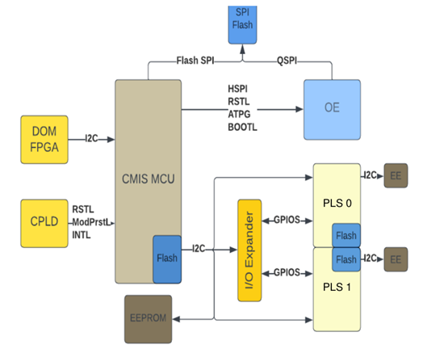
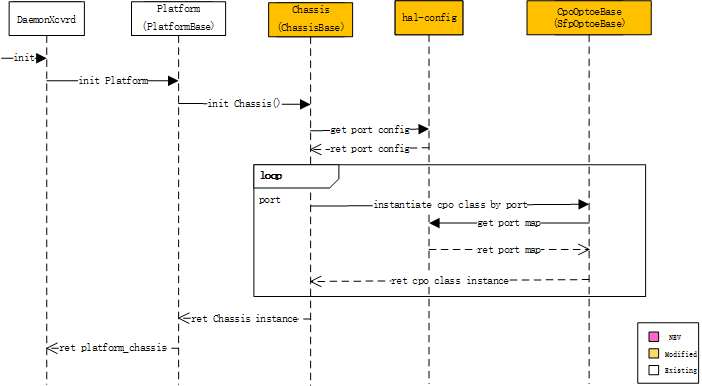
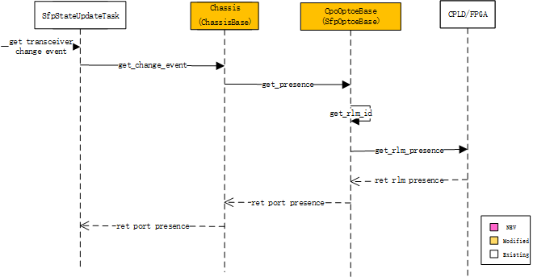
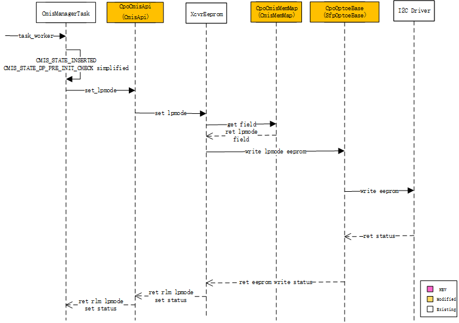

# CPO Community adaption

## Table of Content

## 1. Revision

| Rev |   Date   | Author | Change Description |
| :-: | :------: | :----: | ------------------ |
| 1.0 | Dec 2025 | kroos | Initial version    |

## 2. Scope

This section describes the implementation of cpo in community frame.

Firmware upgrade is not within the scope of this design description.

## 3. Definitions/Abbreviations

OE: Optical Engine

RLM: Remote Laser Module

PLS : Pluggable Laser Sources

CPO: Co-packaged optics

CMIS ： Common Management Interface Specification

## 4. Overview

As shown in the figure below, current CPO devices map OE and PLS components to standard CMIS controllers.

The community xcvrd optical module framework is basically applicable to CPO devices. However, CPO devices still have some special functions that require revisions to the original community code. This document redesigns and revises some functions of the sonic-platform based on the differences between CPO and traditional optical modules.



## 5. Requirements

The management of CPO switches based on the community xcvrd framework mainly involves the following aspects:

1. CPO devices are managed by mapping OE/RLM to the CMIS memory map.The OE part is a CMIS general register, and no special handling is required in the community code. However, the RLM-related registers are currently mapped to the CMIS memory map page: 0xb0-0xb7 addresses. Therefore, it is necessary to add RLM-related management interfaces.
2. CPO devices use multiple banks in the CMIS memory map. However, there is currently no multi-bank processing logic in the community code.
   Therefore, it is necessary to add a multi-bank management process.
3. There is a many-to-one mapping relationship between CPO device ports and OE or RLM. Manufacturers need to maintain the mapping entries between ports and OE/RLM when adapting devices.
4. Community xcvrd management is triggered based on module plug-in events. CPO has no plug-in events, so the xcvrd triggering method needs to be redesigned.

## 6. High-Level Design

### 6.1. Problem Statement

1. RLM-related registers are located in the CMIS Custom section and have not yet formed a universal standard, so they are not reflected in the community code.
2. The current community code has no CMIS multi-bank processing logic.
3. Traditional ports have a one-to-one correspondence with optical modules, which cannot meet the processing logic of CPO devices (where multiple ports correspond to one OE/RLM).
4. There are no insertion/removal events of CPO modules.

### 6.2. New Approach

#### 6.2.1. Sff8024

To address the above issues, the community code needs to handle CPO devices differently. Therefore, a CPO device identification interface is first required.

CPO currently has no new standard definition in the sff8024 specification. We hope that in the future we can apply for a dedicated identifier for CPO products through the SFF standards organization.

At present, the identifier of OE defined in cmis Memory Map page 0; offset 0 is 0x80 (Vendor Specific).

Modify the sff8024 definition:

```
#sff8024.py
class Sff8024(XcvrCodes):
    XCVR_IDENTIFIERS = {
        128: 'CPO' }
```

#### 6.2.2. CmisMemMap

Due to the need to add management support for RLM and to handle multi‑bank management in CMIS, the original community `CmisMemMap` class needs to be revised.

The examples are as follows:

1. Added some RLM-related memory map access functions
2. Revised getaddr to support multi-bank addressing

```
PAGES_PER_BANK  = 240
class CpoCmisMemMap(CmisMemMap):   # new
    def __init__(self, codes, bank):
        super(CmisMemMap, self).__init__(codes)
        self._bank = bank
        self.RLM_CONTROL_STATUS = RegGroupField(consts.RLM_CONTROL_STATUS_FIELD, *fields, **kwargs)
        self.RLM_ADMIN_INFO = RegGroupField(consts.RLM_ADMIN_INFO_FIELD, *fields, **kwargs)
        self.RLM_THRESHOLDS = RegGroupField(consts.RLM_THRESHOLDS_FIELD, *fields, **kwargs)
        ...
    def getaddr(self, page, offset, page_size=128):
        if 0 <= page <= 0x1f:
            bank_id = 0
        else:
            bank_id = self._bank
        return ((bank_id * PAGES_PER_BANK + page) * page_size + offset;
```

The kernel address mapping is as follows (detailed in subsequent chapters):

```
                    +-------------------------------+
                    |        Lower Page             |
                    +-------------------------------+
                    |  Upper Page (Bank 0, Page 0h) |
                    +-------------------------------+
                    |  Upper Page (Bank 0, Page 1h) |
                    +-------------------------------+
                    |             ...               |
                    +-------------------------------+
                    | Upper Page (Bank 0, Page FFh) |
                    +-------------------------------+
                    | Upper Page (Bank 1, Page 10h) |
                    +-------------------------------+
                    |             ...               |
                    +-------------------------------+
                    | Upper Page (Bank 1, Page FFh) |
                    +-------------------------------+
                    | Upper Page (Bank 2, Page 10h) |
                    +-------------------------------+
                    |             ...               |
                    +-------------------------------+
                    | Upper Page (Bank 2, Page FFh) |
                    +-------------------------------+
                    |             ...               |
                         (continued for more banks)
```

#### 6.2.3. CmisApi

Similarly, the corresponding `CmisApi` class also needs to be revised. The examples are as follows:

API revision:

```
class CpoCmisApi(CmisApi):   # new
    def get_rlm_lpmode(self):
    def set_rlm_lpmode(self, lpmode, wait_state_change = True):
    def set_oe_lpmode(self, lpmode, wait_state_change = True):
    def get_rlm_manufacturer(self):
    def get_rlm_vendor_rev(self):
    def get_rlm_identifier(self):
    def get_rlm_laser_disable(self):
    def set_rlm_laser_disable(self,  disable，wait_state_change = True):
    ...

```

#### 6.2.4. SfpOptoeBase

CPO devices require multi-bank function for management use, while there is no such design in community, wei will add it in this design.

Since the instantiation of CMIS is in the `SfpOptoeBase` class, this design puts the management of CMIS multi-bank under `SfpOptoeBase` class.

Define the community CPO public class:  `CpoOptoeBase`, which inherits from the `SfpOptoeBase` class.

The main revisions are as follows:

1. During instantiation, save the corresponding port, oe_id, bank_id, rlm_id according to the configuration file, and provide query interfaces.
2. During instantiation, set the driver’s current oe-related bank count based on the configuration file: set_oe_bank_count.
3. The original member variable self._xcvr_api_factory needs to be re-initialized in the subclass according to bank_id.
4. Provide a new port presence detection method based on RLM status: get_rlm_presence
5. Change port EEPROM read/write operations to be based on OE EEPROM read/write.

```
class CpoOptoeBase(SfpOptoeBase):  # new
    def __init__(self, index，bank_id, oe_id, rlm_id):
        SfpOptoeBase.init(self)
    self._port_id = index
    self._bank_id = bank_id
    self._oe_id = oe_id
    self._rlm_id = rlm_id
    self.set_oe_bank_count()
    self._xcvr_api_factory = XcvrApiFactory(self.read_eeprom, self.write_eeprom, self._bank_id)
  
    def get_bank_id(self):
        return self._bank_id
    def get_oe_id(self):
    def get_rlm_id(self):
    def read_eeprom(self, offset, num_bytes):  #modify
    def write_eeprom(self, offset, num_bytes, write_buffer):  #modify
    def get_rlm_presence(self, rlm_index):
        baseutil.get_config().get("sfps", None).get("rlm_presence", 0)
    def get_eeprom_path(self, oe):
        # get oe bank count from config file
        baseutil.get_config().get("sfps", None).get("eeprom_path", 0)
    def get_presence(self)
        return self.get_rlm_presence(self.get_rlm_id())
    def set_lpmode(self, lpmode):
    def get_oe_bank_count_path():
        # get oe bank count from config file
    def get_oe_bank_count(self):
        # get oe bank count from config file
    def set_oe_bank_count(self):
        # set oe bank count to oe_bank_count_path
    ...
```

#### 6.2.5  XcvrApiFactory

Modify the class instance for CPO processing.

The main revisions are as follows:

1. Use CPO-related classes for CPO-type devices.
2. Instantiation of `CpoCmisMemMap` requires passing bank_id as an argument.

```
#xcvr_api_factory.py
class XcvrApiFactory(object):
    def __init__(self, reader, writer, bank=0):
        self._bank= bank
    def _create_cpo_cmis_api(self):  # new
        xcvr_eeprom = XcvrEeprom(self.reader, self.writer, CpoCmisMemMap(CmisCodes, self._bank))
        api = CpoCmisApi(xcvr_eeprom, cdb_fw)
    def create_xcvr_api(self):
        id = self._get_id()
        id_mapping = {
            0x80: (self._create_cpo_cmis_api, ()),   # CPO type
        }
```

#### 6.2.6 ChassisBase

Manufacturers inherit the `ChassisBase` class in sonic_platform to implement the instantiation of `CpoOptoeBase`.

The main revisions are as follows:

1. Perform special handling based on the HAL configuration for CPO-type devices.
2. Instantiation of `CpoOptoeBase` requires passing port, oe_id, bank_id, and rlm_id as arguments.

```
class Chassis(ChassisBase):
    def __init__(self):
        ChassisBase.__init__(self)
        try:
            self._sfp_list = []
            sfp_hal_config = baseutil.get_config().get("sfps", None)
            if sfp_hal_config.get("ver", None) == "CPO": 
                interfaces = sfp_hal_config.get("interfaces", 0)
                for index, port in interfaces:
                    self._sfp_list.append(CpoOptoeBase(index, port["bank"], port["oe"], port["rlm"]))
    def is_cpo():
        sfp_hal_config = baseutil.get_config().get("sfps", None)
            return sfp_hal_config.get("ver", None) == "CPO"

```

#### 6.2.7 hal config

For CPO-related configuration files, vendors need to adapt them according to the new CPO processing framework.

The main revisions are as follows:

1. Define the `ver` version information as "CPO", used for instantiating CPO-related classes.
2. Add new fields `oe_bank_count` and `bank_count_path` to pass the number of banks in the memmap to the driver.
3. Add a new field `interfaces` to store the mapping relationships between ports and oe, bank, rlm.
4. Add a new field `rlm_presence` to reflect the presence status of RLMs, which is used to determine the presence status of the original community ports.
5. Revise the `eeprom_path`   and `eeprom_path_key`  fields to point to the EEPROM associated with the corresponding OE. EEPROM read/write operations for ports will be performed based on the associated OE.

```
{
    "sfps": {
    "ver": 'CPO',
    "oe_bank_count": 8,
        "bank_count_path": "/sys/bus/i2c/devices/i2c-%d/%d-0050/bank_count",
        "interfaces": {
            "0": {"bank": 0,  "oe": 0,  "rlm": 0},
            "1": {"bank": 1,  "oe": 0,  "rlm": 0},
            ...
            "64": {"bank": 7,  "oe": 7,  "rlm": 15}
    }，
    "rlm_presence": {
            "/dev/fpga1": {
                "offset": {
                    "0x64": [None]*8 + list(range(8)) + [None]*8 + list(range(8,16)) 
                }
            }
    },
    "eeprom_path": "/sys/bus/i2c/devices/i2c-%d/%d-0050/eeprom",
    "eeprom_path_key": list(range(24, 32)),
    ...
}
```

#### 6.2.8 CmisManagerTask

When the xcvrd module processes the set_lpmode, CPO needs to additionally set RLM to full-power mode.

The pseudo-code is as follows：

```
class CmisManagerTask(threading.Thread):
    def task_worker(self):
        CMIS_STATE_DP_DEINIT：
            api.set_datapath_deinit
            api.tx_disable_channel
            api.set_lpmode

            if platform_chassis.is_cpo()
                api.set_rlm_lpmode(False, wait_state_change = False)

```

#### 6.2.9 optoe driver

The current optoe driver does not yet support bank switching, It is certainly possible to handle bank and page switching at the upper-layer interface, using locks to prevent conflicts.

However, this approach introduces additional complexity in both implementation and usage-every read and write from the upper software layer would need to perform explicit bank and page switching, and the locking and unlocking logic would be difficult to standardize.

A better approach is to have the driver itself manage bank and page switching, along with the associated locking operations, thereby avoiding unnecessary complexity for the upper software layers. so the driver code needs to be updated to accommodate this new feature.

We can use the revisions from the following PR to enable bank switching support in the optoe driver.

> https://github.com/sonic-net/sonic-linux-kernel/pull/473

This PR contains the following issues that need to be addressed.

1) The algorithm in the optoe_translate_offset function may contain issues and needs to be fixed. This has already been discussed in the PR. This issue was resolved by applying special handling to getaddr within the CmisMemMap class.

It is recommended  to use the driver that supports bank switching in optoe. If there are unavoidable special requirements, also may choose not to load the optoe driver and instead load the standard at24 driver. In that case, the upper-layer software would need to handle bank and page switching on its own, as well as manage conflict avoidance.

### 6.3. Implementation Flow

#### 6.3.1 DaemonXcvrd Init

Initialize the `DaemonXcvrd` global variable platform_chassis according to the newly defined `CpoOptoeBase` class and hal-config.

platform_chassis = sonic_platform.platform.Platform().get_chassis()



#### 6.3.2. SfpStateUpdateTask

CPO has no module plug-in scenario, but the original community module plug-in event can be triggered through the presence of RLM.

Customize the module presence interface through the platform-inherited class `Chassis(ChassisBase): get_transceiver_change_event`.

In the custom `Chassis(ChassisBase)` class get_transceiver_change_event interface, call the get_presence interface whose inheritance relationship is `CpoOptoeBase(OptoeBase)`.

This part of the logic is consistent with that of ordinary optical modules. In the get_presence interface of `CpoOptoeBase`, it is necessary to query the corresponding RLM information according to the port. Then, obtain its presence information according to rlm_id.



#### 6.3.3  CmisManagerTask

The process of `CmisManagerTask` is basically the same as the original, except that the used SFP API is replaced with the newly added `CpoCmisApi`.

The following takes the CPO device additionally setting RLM to high-power mode in the CMIS_STATE_DP_DEINIT stage as an example to illustrate the calling sequence after adding `CpoCmisApi`.

The specific sequence diagram is as follows.It includes functions related to RLM management and multi-bank processing.(Parts consistent with the original process have been simplified)



### 6.4. Unit Test cases

1. CPO device identification interface testing
2. Parsing tests for each configuration parameter in hal config
3. Function tests for each function of the newly added `CpoOptoeBase` class
4. Function tests for each function of the newly added `CpoCmisApi` class
5. Function tests corresponding to the newly added `CpoCmisMemMap` class

### 6.5. Open/Action items - if any

WIP
